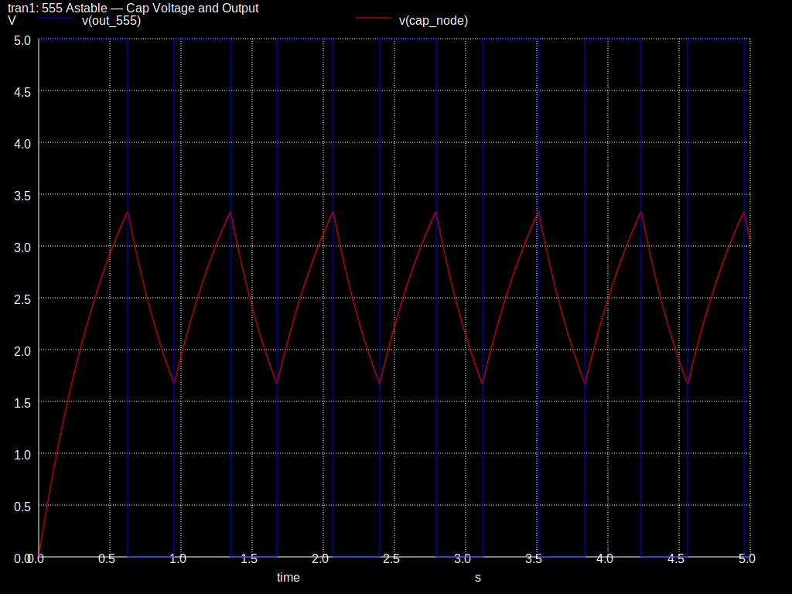

# Open-Source EDA Portfolio

A collection of electronics design projects built with free and open-source
EDA tools on Fedora Linux (KDE). The projects progress from basic simulation
through schematic capture to programmatic PCB generation with automated routing.

## Projects

| # | Project | Tool | Domain | Description |
|---|---------|------|--------|-------------|
| 1 | [RC Low-Pass Filter](ngspice-rc-filter/) | Ngspice | Analog | AC sweep analysis with Bode magnitude and phase plots |
| 2 | [Inverting Op-Amp Amplifier](qucs-s-opamp-amplifier/) | Qucs-S + Ngspice | Analog | Classic inverting amplifier with transient and AC analysis |
| 3 | [555 Timer Astable PCB](librepcb-555-timer/) | LibrePCB + Python | PCB Design | Programmatic PCB generation — schematic, netlist, board layout, and two-layer routing all generated from Python scripts |

### Preview

**RC Low-Pass Filter — Bode Magnitude:**


**Inverting Op-Amp — Transient Response:**


**555 Timer — Capacitor Charge/Discharge and Output:**



**555 Timer — Board Layout (DRC: 0 errors):**


## Project Highlights

### Ngspice RC Filter
Straightforward SPICE simulation demonstrating AC sweep, Bode plots, and
step response. Good introduction to command-line EDA workflows.

### Qucs-S Op-Amp
GUI-based schematic capture with Ngspice backend. Covers transient analysis,
AC frequency response, and comparison against the ideal gain formula
(G = −R_f / R_in).

### LibrePCB 555 Timer (Programmatic)
The flagship project. Two Python scripts generate a complete LibrePCB project
from scratch — no manual GUI interaction:

- `generate_555.py` produces the full project: circuit netlist (7 nets,
  14 components), schematic with all symbols wired, board with footprints
  placed on a 150×100mm PCB, ground plane, and project-local library
  elements for the NE555 and a THT bipolar capacitor.
- `simple_route6.py` routes all traces using a two-layer geometric algorithm
  with vias, mathematically verified to have zero crossing violations.

This required reverse-engineering LibrePCB's undocumented S-expression file
format, resolving ~50 UUID dependency chains across library elements, and
solving the graph planarity problem inherent in the 555 timer's netlist.

## Tools & Versions

All tools installed on **Fedora 43 (KDE Plasma)**:

```bash
# Simulation tools
sudo dnf install ngspice qucs-s

# PCB design tool
flatpak install flathub org.librepcb.LibrePCB
```

The LibrePCB project generation requires only Python 3.6+ (no additional
packages).

## Running the Projects

### Ngspice (CLI)

```bash
cd ngspice-rc-filter/
ngspice rc_lowpass.cir
```

### Qucs-S (GUI)

1. Open Qucs-S
2. **File → Open** → select `qucs-s-opamp-amplifier/inverting_amp.sch`
3. Press **F2** or click **Simulate** to run

### LibrePCB 555 Timer (Programmatic)

```bash
cd librepcb-555-timer/

# Generate the full project
python3 generate_555.py

# Route the board
python3 simple_route6.py

# Open in LibrePCB and run DRC — zero errors
flatpak run org.librepcb.LibrePCB
```

Requires LibrePCB with official libraries downloaded and workspace at
`~/LibrePCB-Workspace`.

## Repository Structure

```
eda-portfolio/
├── README.md
├── ngspice-rc-filter/
│   ├── README.md
│   ├── rc_lowpass.cir
│   ├── rc_lowpass_step.cir
│   ├── images/
│   │   ├── bode_magnitude.svg
│   │   ├── bode_phase.svg
│   │   └── step_response.svg
│   └── docs/
│       └── theory.md
├── qucs-s-opamp-amplifier/
│   ├── README.md
│   ├── inverting_amp.sch
│   ├── inverting_amp.cir
│   ├── images/
│   │   ├── ac_magnitude.svg
│   │   ├── ac_phase.svg
│   │   └── transient.svg
│   └── docs/
│       └── theory.md
└── librepcb-555-timer/
    ├── README.md
    ├── generate_555.py         ← generates full LibrePCB project
    ├── simple_route6.py        ← two-layer geometric router
    ├── 555_astable.cir         ← pre-layout Ngspice simulation
    ├── images/
    │   ├── sim_cap_output.svg
    │   ├── 555_Timer_Astable_Schematics.pdf       ← auto-generated schematic
    │   └── 555_Timer_Astable_Board.pdf        ← Routed board (0 errors)
    └── docs/
        ├── theory.md
        └── build_guide.md      ← technical deep-dive on generation
```

## License

This portfolio is released under the [MIT License](LICENSE).

## Author

Yuval Levental — [LinkedIn](https://www.linkedin.com/in/yuval-levental) · [GitHub](https://github.com/ylevental)
