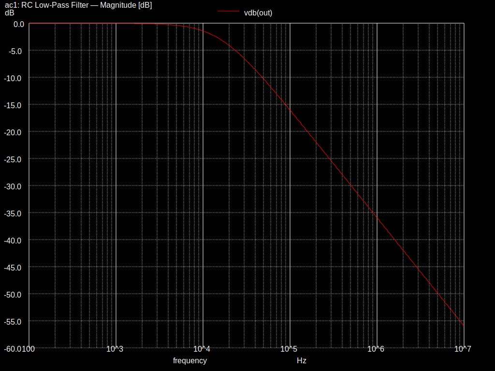
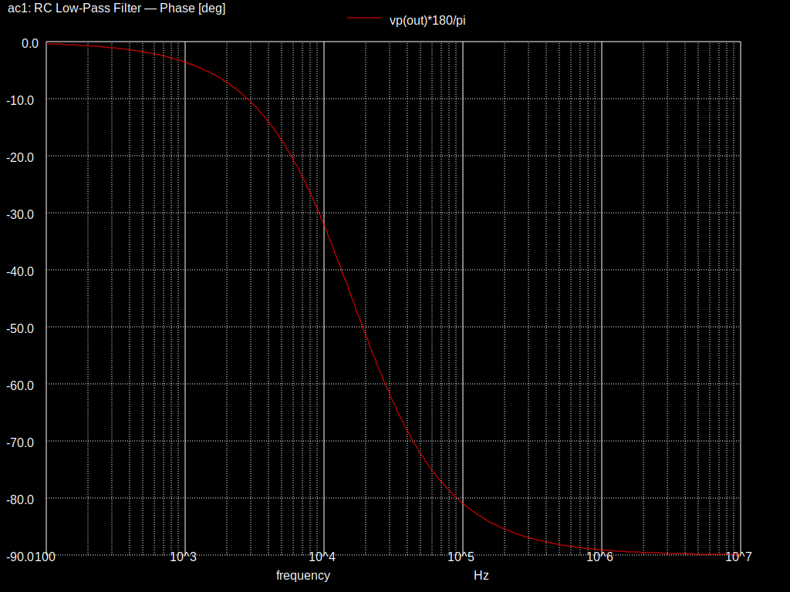
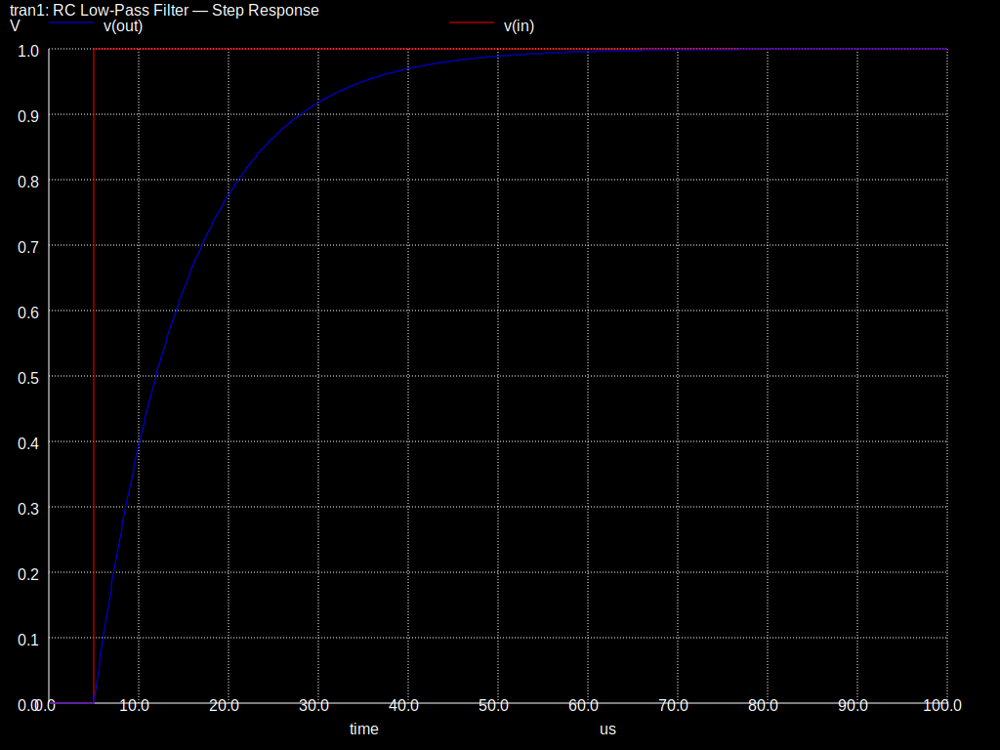

# RC Low-Pass Filter — Ngspice

A first-order passive RC low-pass filter analyzed with Ngspice. This project
demonstrates AC sweep (Bode plot) and transient (step response) analysis using
a simple, well-documented SPICE netlist.

## Circuit

```
    Vin ──[ R1 1kΩ ]──┬── Vout
                       │
                      [C1]
                      10nF
                       │
                      GND
```

**Component values:**

| Part | Value |
|------|-------|
| R1   | 1 kΩ  |
| C1   | 10 nF |

## Key Parameters

| Parameter | Formula | Value |
|-----------|---------|-------|
| Cutoff frequency (f_c) | 1 / (2π · R · C) | **15.92 kHz** |
| Time constant (τ) | R · C | **10 µs** |
| Roll-off slope | — | −20 dB/decade |

## Simulations

### 1. AC Sweep — Bode Plot (`rc_lowpass.cir`)

Sweeps frequency from 100 Hz to 10 MHz (decade spacing, 100 points per
decade) and plots gain in dB and phase in degrees. Ngspice automatically
measures the −3 dB cutoff frequency.

```bash
ngspice rc_lowpass.cir
```

**Magnitude Response:**



**Phase Response:**



**What to look for:**
- Flat passband below ~1 kHz (0 dB)
- −3 dB point near 15.9 kHz
- −20 dB/decade slope in the stopband
- Phase shifting from 0° toward −90°

### 2. Step Response (`rc_lowpass_step.cir`)

Applies a 0 → 1 V step and observes the exponential rise of the output.
Ngspice measures the time constant and 10%–90% rise time.

```bash
ngspice rc_lowpass_step.cir
```



**What to look for:**
- Output reaches ~63.2% at t = τ (10 µs after the step)
- Output reaches ~95% at t = 3τ (30 µs)
- Smooth exponential curve with no ringing (first-order system)

## Saving Plots

Inside Ngspice's interactive shell, you can export plots to SVG using
the SVG button in the plot window, or via the command line:

```
set hcopydevtype = svg
hardcopy bode_magnitude.svg vdb(out)
```

## Further Experiments

Try modifying the netlist to explore:
- Change R1 to 10 kΩ → cutoff drops to 1.59 kHz
- Add a second RC stage in series → second-order filter (−40 dB/decade)
- Replace the capacitor with an inductor → high-pass behavior

## References

- [Ngspice User Manual](https://ngspice.sourceforge.io/docs.html)
- Horowitz & Hill, *The Art of Electronics*, Ch. 1
