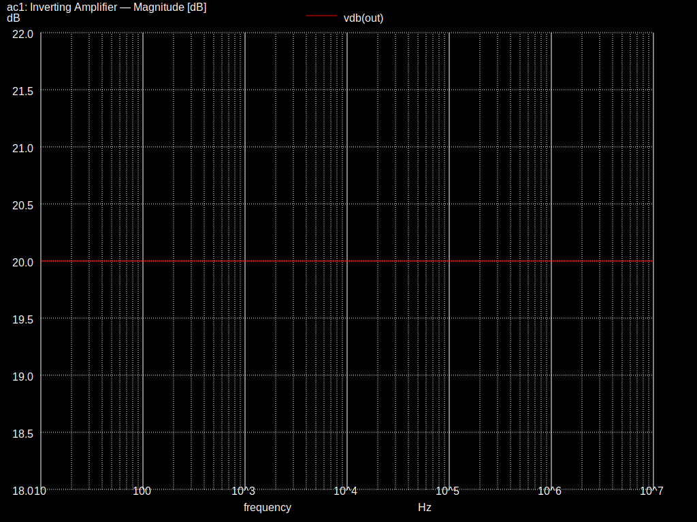
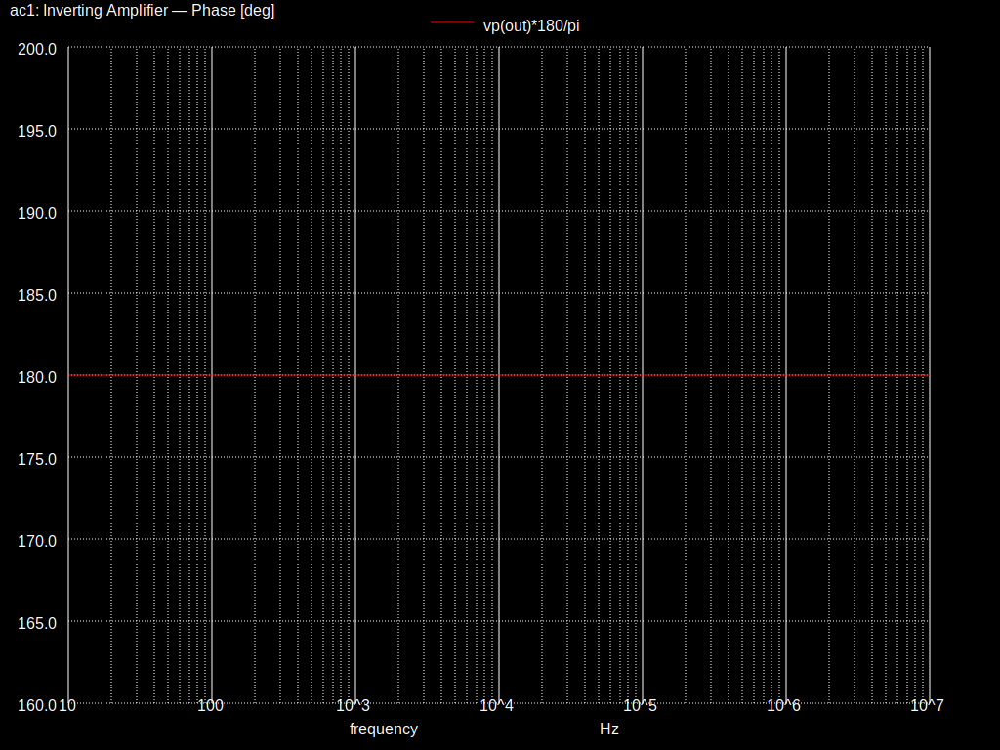
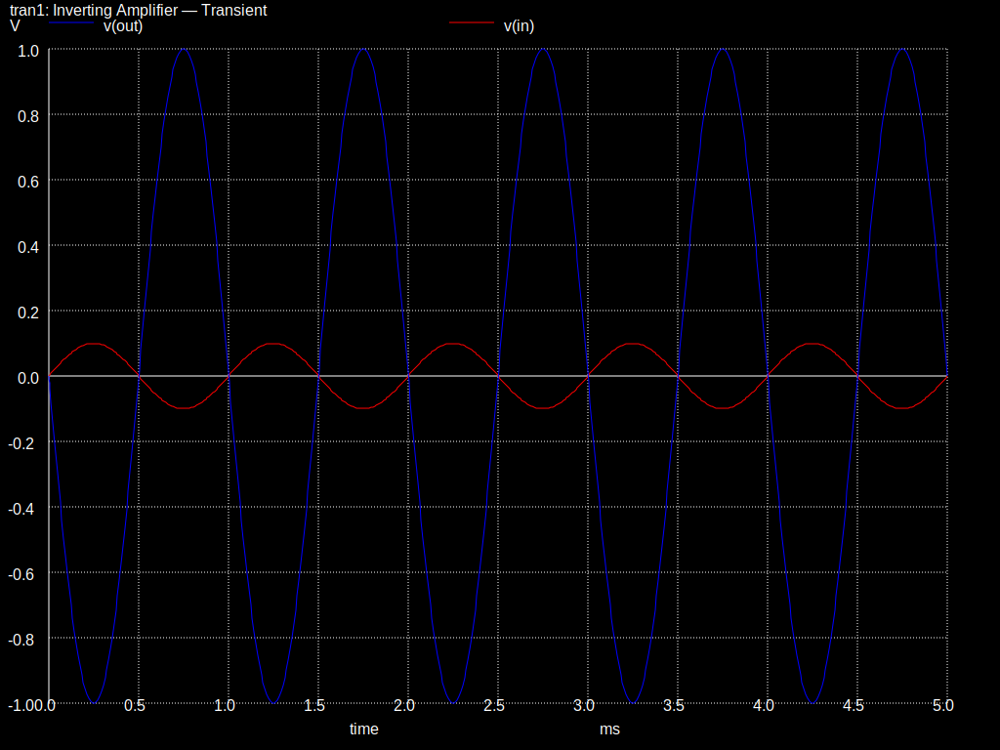

# Inverting Op-Amp Amplifier — Qucs-S

A classic inverting amplifier designed and simulated in Qucs-S with the
Ngspice backend. Demonstrates schematic entry, AC analysis, and transient
analysis in a GUI-based workflow.

## Circuit

```
             Rf (10 kΩ)
         ┌───[RRRR]───┐
         │             │
 Vin ──[R1 1kΩ]──┬──(−)    ╲
                  │     OpAmp >── Vout
              GND─┤──(+)    ╱
                  │
                 GND
```

**Component values:**

| Part | Value  | Role               |
|------|--------|--------------------|
| R1   | 1 kΩ   | Input resistor     |
| Rf   | 10 kΩ  | Feedback resistor  |
| OP1  | Ideal  | Op-amp (gain 10⁶)  |
| V1   | 1 V AC | Signal source      |

## Key Parameters

| Parameter | Formula | Value |
|-----------|---------|-------|
| Voltage gain (Av) | −Rf / R1 | **−10** |
| Gain in dB | 20 · log₁₀(\|Av\|) | **20 dB** |
| Input impedance | R1 | **1 kΩ** |
| Phase shift (midband) | — | **180°** (inverting) |

## Running in Qucs-S

1. Open Qucs-S (make sure Ngspice is set as the simulation backend)
2. **File → Open** → select `inverting_amp.sch`
3. Press **F2** to simulate
4. Add a Cartesian diagram to the schematic to view `Vout.V`

> **Note:** If the schematic layout needs adjustment after opening, you can
> rearrange components on the canvas — the netlist connectivity is preserved.

## Running with Ngspice Directly

An equivalent netlist is provided for standalone verification:

```bash
ngspice inverting_amp.cir
```

This produces the same Bode and transient plots without needing the Qucs-S GUI.

## What to Observe

**AC Analysis — Magnitude:**



**AC Analysis — Phase:**



- Flat gain of 20 dB from DC up to the gain-bandwidth product
- Midband phase of approximately −180° (signal inversion)

**Transient Analysis:**



- Input: 100 mV sine at 1 kHz
- Output: 1 V sine at 1 kHz, **inverted** (180° phase shift)
- Gain = Vout_peak / Vin_peak = 1.0 / 0.1 = 10

## Further Experiments

- Swap R1 and Rf values → gain becomes −0.1 (attenuator)
- Add a capacitor in parallel with Rf → low-pass active filter (integrator)
- Replace the ideal op-amp with a real model (e.g., LM741) to see bandwidth limits

## Files

| File | Description |
|------|-------------|
| `inverting_amp.sch` | Qucs-S schematic (open in Qucs-S GUI) |
| `inverting_amp.cir` | Ngspice netlist (run from command line) |
| `docs/theory.md` | Design equations and derivations |

## References

- [Qucs-S Documentation](https://qucs-s-help.readthedocs.io/)
- [Ngspice User Manual](https://ngspice.sourceforge.io/docs.html)
- Horowitz & Hill, *The Art of Electronics*, Ch. 4
